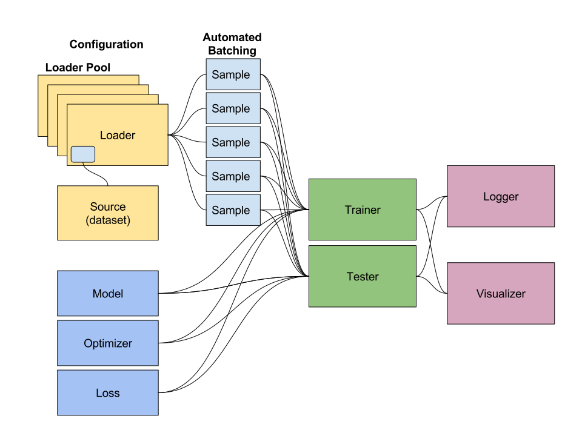

# A pytorch library for building neurals networks for visual recognition, encoding, and detection tasks

# Detailed description coming...

# Running Locally for Ubuntu16.04

Install: `sudo bash pytlib/install.sh`

Start up virtualenv: `cd pytlib; source pytenv/bin/activate`

Run the trainer: `python train/trainer.py ...`

# Running with Docker
Create the docker container run `docker-compose up -d --force-recreate --build`

Now run `docker ps` you should see a container running.

Now to attach a shell script to the container run `docker exec -it <name_of_docker_process> /bin/bash`.

Export your python path by running `export PYTHONPATH="${PYTHONPATH}:/pytlib"`
Activate your virtualenv with `source pytenv/bin/activate`

Note: CUDA support in docker not tested yet.
