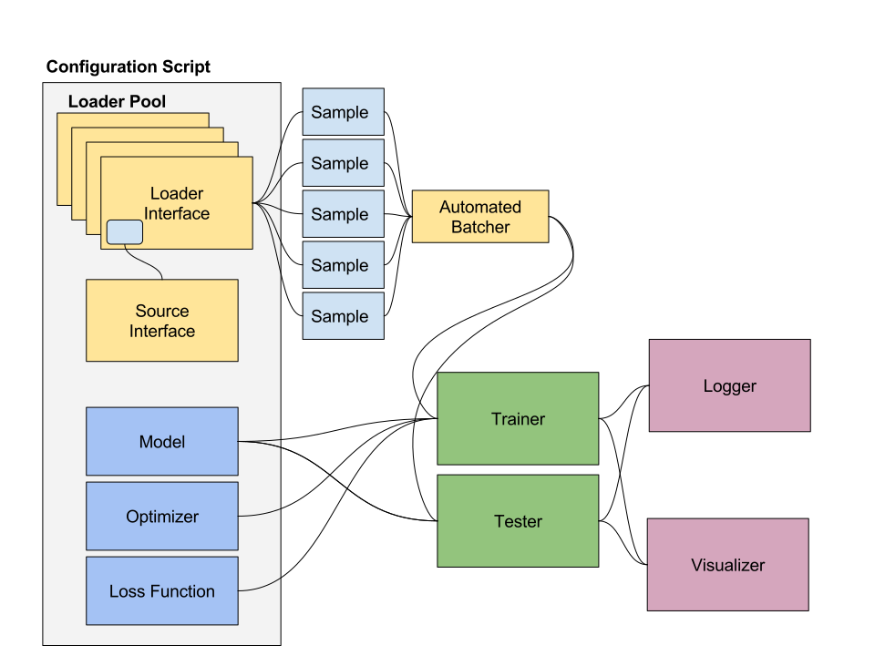
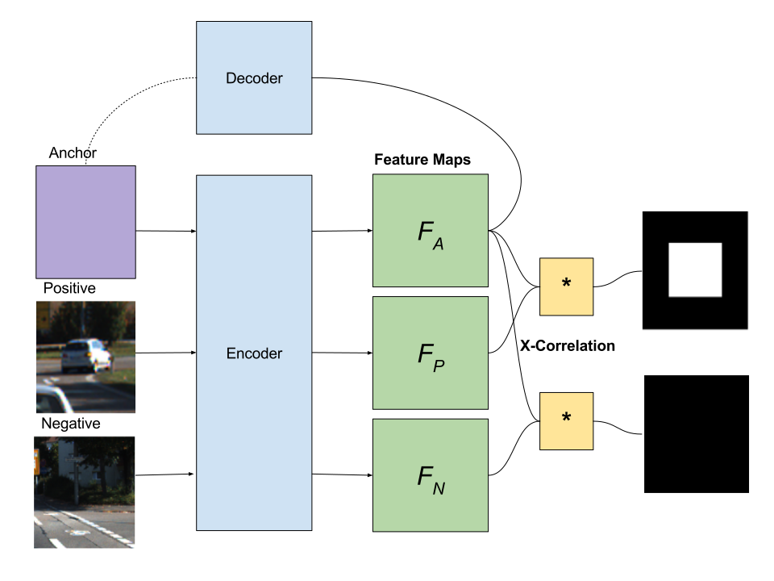
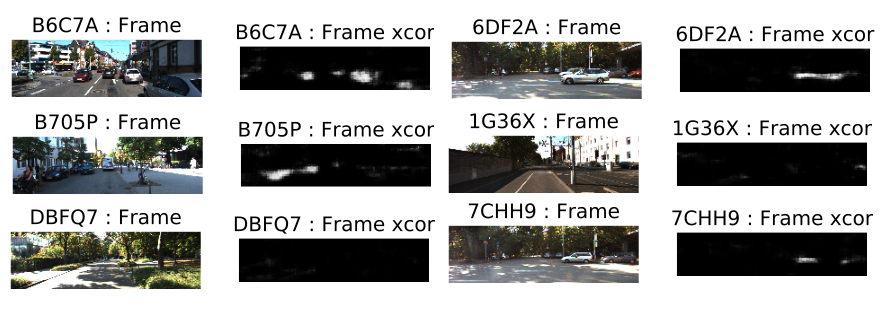

# A [pytorch](http://pytorch.org/) library for building neurals networks for visual recognition, encoding, and detection tasks

There are many common challenges with training deep neural nets for vision tasks using real world data beyond the classic MNIST and Imagenet datasets, such as properly handling the loading of large images for batched training without bottlenecking performance, augmenting samples with perturbations, generating and storing visualizations from different parts of the pipeline. This library tries address some of these issues in a scalable way, coupled with the flexible architecture of pytorch, to allow the user to quickly experiment with different datasets and different models in deeplearning vision research.

## Some Key Features

* Threaded loader pool to elimiante dataloading time during training
* Automated batch handling from end-to-end. Users only need to write code to generate a single 
training example. The framework takes care of the batching and debatching for you.
* Flexible image class abstracts away intensity scaling and byte ordering differences between PIL images and torch tensors
* Helpful utilities to deal with common vision taskes as affine transforms, image perturbations,
defining pixel masks and bounding boxes.
* Visualization and Logging tools allows json data and images to be recorded from anywhere in the pipeline
* Built to support dynamic sized models (tensor sizes are determined at runtime given inputs, this is a frequent issue when you don't want to just build models that support a single resolution)
* Model saving and loading
* Code as configuration. A single python script fully defines all components that can used to train and test a model.

# Examples and Active projects

## Variational autoencoder 
Example implementation of a vanilla [variational auto-encoder](https://arxiv.org/abs/1312.6114)  using the [Stanford Cars dataset](http://ai.stanford.edu/~jkrause/cars/car_dataset.html). The configuration is defined [here](pytlib/configuration/vae_config_stanford_cars.py). We use the [autoencoder_loader](pytlib/data_loading/loaders/autoencoder_loader.py) and the [vae network](pytlib/networks/vae.py) with the [vae loss function](pytlib/loss_functions/vae_loss.py). Below shows input/output pair visualizations produced by this configuration.

## Encoding Detector (Active project)

Most of state-of-the-art detection/localization methods involve either direct bounding box regression and refinement (ie SSD or YOLO variants) or using region proposals (ie: RCNN variants). However, these methods can learn strong biases towards the contextual information that the model is trained on and can overfit to output bounding boxes without ever learning a useful feature representation of the objects in question. A different way to approach the problem is attempt to learn some average representation of the object (ie: a car) in a highly constrained feature space and use that representation to find regions of high correlation in some search space. This is inspired by the work by [Bertinetto et al.](http://www.robots.ox.ac.uk/~luca/siamese-fc.html) using a simple cross-correlation siamese network to track arbitrary objects. Here the idea is to learn an anchor feature map with the help of a varianational autoencoder and then maximizing the cross-correlation signal between anchor and a positive feature while minimizing the signal between anchor and a negative feature. See diagram below.

At inference time, the method is extremely simple and efficient, we just evaluation the cross-correlation between the car feature map \phi(F) and the search image feature map \phi(X).

The following shows some example outputs of the encoding detector on trained feature maps on cars from the [KITTI](http://www.cvlibs.net/datasets/kitti/) dataset on full frame holdout test images. White pixels shows regions that are highly likely to be cars.

# Running Locally on Native Ubuntu 16.04

Install: `sudo bash pytlib/install.sh`

Start up virtualenv: `cd pytlib; source pytenv/bin/activate`

Run the trainer: `python run/trainer.py ...`

More helpful instructions to come ...

# Running with Docker
Create the docker container run `docker-compose up -d --force-recreate --build`

Now run `docker ps` you should see a container running.

Now to attach a shell script to the container run `docker exec -it <name_of_docker_process> /bin/bash`.

Export your python path by running `export PYTHONPATH="${PYTHONPATH}:/pytlib"`
Activate your virtualenv with `source pytenv/bin/activate`

Note: CUDA support in docker not tested yet.
