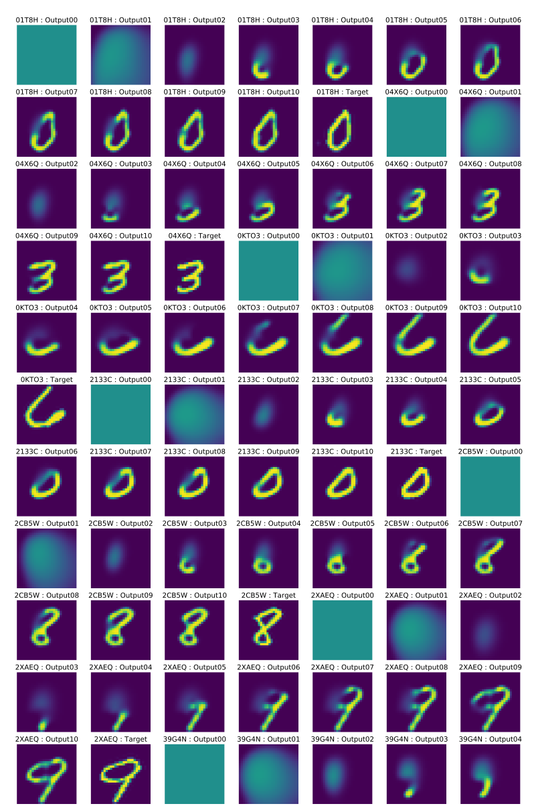
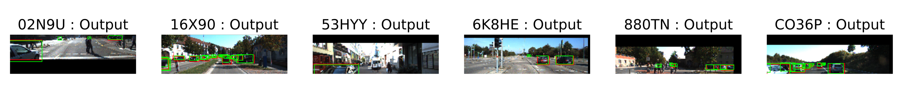

# A [pytorch](http://pytorch.org/) library for building neurals networks for visual recognition, encoding, and detection tasks

There are many common challenges with training deep neural nets for vision tasks using real world data beyond the classic MNIST and Imagenet datasets, such as properly handling the loading of large images for batched training without bottlenecking performance, augmenting samples with perturbations, generating and storing visualizations from different parts of the pipeline. This library addresses some of these challenges in a scalable way. Coupled with the flexible architecture of pytorch, it allows the user to quickly experiment with different datasets and different models in deeplearning vision research.

## Some Key Features

* Code as configuration. A single python script fully defines all components that can used to train and test a model.
* Automated batch handling from end-to-end. Users only need to write code to generate a single 
training example. The framework takes care of the batching and debatching for you.
* Flexible image class abstracts away intensity scaling and byte ordering differences between PIL images and pytorch tensors
* Helpful utilities to deal with common vision tasks such as affine transforms, image perturbations,
defining pixel masks and bounding boxes.
* Visualization and Logging tools allows json data and images to be recorded from anywhere in the pipeline
* Built with dynamically sized inputs in mind (model sizes are determined at train-time given inputs, this is a frequent real-world issue when you don't want to just build models that support a single resolution)
* Model saving and loading
* Threaded loader pool to elimiante dataloading overhead during training

# Examples and Active projects

## [Variational autoencoder](pytlib/configuration/vae_config_stanford_cars.py)
Example implementation (extended from [pytorch vae for MNIST](https://github.com/pytorch/examples/tree/master/vae)) of a vanilla [variational auto-encoder](https://arxiv.org/abs/1312.6114)  using the [Stanford Cars dataset](http://ai.stanford.edu/~jkrause/cars/car_dataset.html). The configuration is defined [here](pytlib/configuration/vae_config_stanford_cars.py). We use the [autoencoder_loader](pytlib/data_loading/loaders/autoencoder_loader.py) and the [vae network](pytlib/networks/vae.py) with the [vae loss function](pytlib/loss_functions/vae_loss.py). Below shows input/output pair visualizations produced by this configuration after an hour of training on a GPU. Note the trademark blurry reconstruction from a VAE using purely mean squared loss.

## [Sequential VAE, (DRAW)](pytlib/configuration/draw_mnist_config.py)
An implementation of the [Deep Recurrent Attentive Writer](https://arxiv.org/abs/1502.04623). This recurrent writer uses the VAE gaussian prior sampler, a vanilla RNN (instead of LSTM), and the same Gaussian attention mechanism used in the paper. The MNIST dataset is way too easy of a problem. The training was very quick with a relatively small batch and converges well below 10k iterations. The goal here was to tryout the Gaussian attention mechanism. Moving toward, one direction I have is to investigate the [Inverse Draw](https://openai.com/requests-for-research/#inverse-draw) problem. Another is to use the recurrent attention mechanism for the detection problem. Some results is shown below. Implementation is [here](pytlib/networks/draw.py) and loss is [here](pytlib/loss_functions/vae_loss.py).

## [Encoding Detector](pytlib/configuration/triplet_detector_config.py)

Most of state-of-the-art object detection/localization methods involve either direct bounding box regression or refining region proposals (ie SSD, YOLO, Faster RCNN etc.). However, these methods are not fully convolutional (translation invariant) and can overfit to output bounding boxes without ever learning a useful feature representation of the objects in question. A different way to approach the problem is attempt to learn a representation of a class of objects (ie: a car) in a highly constrained feature space and use that representation to find regions of high correlation in some search space. 

This is inspired by the work of [Bertinetto et al.](http://www.robots.ox.ac.uk/~luca/siamese-fc.html) using a simple cross-correlation function to learn a single-shot object representation for tracking. Here the problem we want to solve is not searching for a glimpse of an object in a larger subspace, but searching for an entire class of objects. We want to see if we can learn an average representation of an entire class of objects and use it to localize instances of that class in search images. We know that a Variational Autoencoder is capable of learning a representation such that similiar inputs are mapped to nearby points in some latent space. We can take advantage of this representation and use it as our cross-correlation anchor to map regions of high similiarity near similiar objects and low similiarity near negatives. 

At inference time, the method is extremely simple and efficient, we just evaluate the cross-correlation signal between the object feature map \phi(F) and the search image feature map \phi(X). In fact, since the object feature map is fixed, we don't even need to recompute it everytime. The cross correlation function can also be efficiently computed using Fast Fourier Transforms.

The following shows some example outputs of the encoding detector on trained feature maps on cars from the [KITTI](http://www.cvlibs.net/datasets/kitti/) dataset on full frame holdout test images. White pixels shows regions that are highly likely to be cars.

## [Anchorless Object Detector](pytlib/configuration/multobjectdet_config.py)

Most SOTA object detectors regress on anchor boxes to make the problem easier to learn. But anchor boxes introduce other complexities such as when anchors fail to match against objects, prediction is not even attempted. Furthermore the performance of the detector is strongly coupled to the choice anchors, an undesirable hyperparameter that forces overfitting some prior dataset. Here is a simple implementation of a 1-stage anchorless detector where a detector head just regresses directly to some fixed number of bounding boxes, trained on KITTI dataset. Checkout the [detector implementation](pytlib/networks/multi_object_detector.py) and the [loss functions](pytlib/loss_functions/multi_object_detector_loss.py).

# Running Locally on Native Ubuntu 16.04

Install: `bash pytlib/install.sh`

Start up virtualenv: `cd pytlib; source pytenv/bin/activate`

Train an example simple autoencoder for 100 iterations, batch size of 32: `python run/trainer.py -t configuration/mnist_ae_config.py -i 100 -b 32 -v 100`

This will train (on cpu*) a basic CNN autoencoder on the mnist dataset and produce a visualization at the end of the 100 iterations. All the data is stored in `tmp` directory in the current directory. To view the visualization:

`eog tmp/visualizations_00000100.svg`

Try adjusting some parameters in the configuration. For example you can switch to training on the gpu by simply setting `cuda=true` inside the `TrainConfiguration` initializer line. 

More helpful instructions to come ...

*After upgrading to pytorch 1.0, CPU training seems to be busted. Will only run right now if you have a GPU

# Running with Docker
Create the docker container run `docker-compose up -d --force-recreate --build`

Now run `docker ps` you should see a container running.

Now to attach a shell script to the container run `docker exec -it <name_of_docker_process> /bin/bash` 

Now you should be able to do just cd into pytlib and start running, no need to use a virtual env because we've installed all the packages directly in the container

`cd pytlib; python run/trainer.py -t configuration/mnist_ae_config.py -i 100 -b 32 -v 100`

Note I haven't configured the docker image with Nvidia and CUDA drivers yet... 
